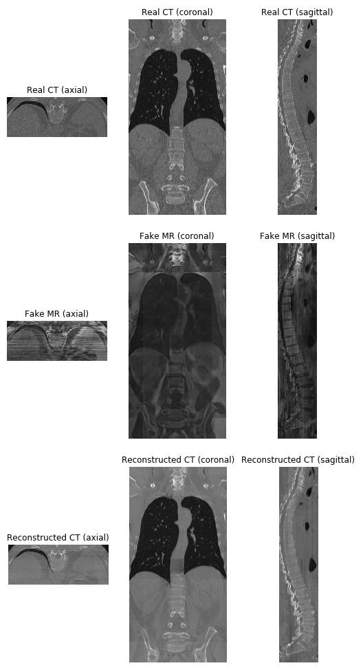
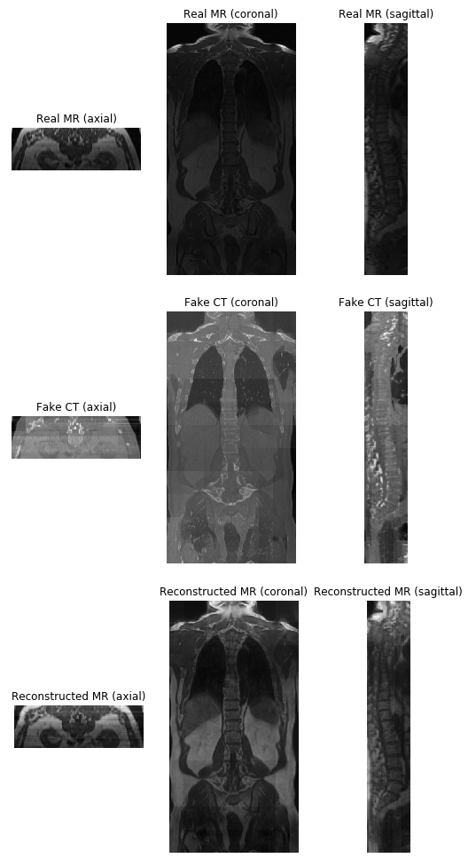

# Spinal to CT translation using CycleGAN

A fork of https://github.com/junyanz/pytorch-CycleGAN-and-pix2pix. The original repository was modified for Spinal to CT translation project.

Main modifications:
1. unaligned_dataset.py - allows the network to take in numpy arrays
2. util/scan.py - functions to generate scans during inference
3. test.py - used functions in util/scan.py to generate fake and reconstructed scans.

### Quick start
1. Put data (numpy arrays) in datasets folder. The data should be separated in 4 folders: trainA, trainB, testA, testB. 
The folders trainA and trainB should contain numpy arrays, each of which contains exactly one patch that is accessible from
'data' field. Test sets testA and testB should contain scans (3d) in numpy format. The capital letters indicate the domain, so
be sure that the right domain is in the right folder.

2. Modify ```scripts/train_cyclegan.sh``` to train the cyclegan based on your preferred configurations. Then train the network by executing
```./scripts/train_cyclegan.sh```. GPU usage is supported and encouraged for faster training time.

3. Intermediary results are stored in ```checkpoints/model_name/``` and it is updated every certain epochs. It contains images, weights and loss curve.

4. Once training is done, modify scripts/test_cyclegan.sh for inference. Then execute ```./scripts/test_cyclegan.sh``` to run inference. The results
can be viewed in the directory ```/results/model_name```.

### Results
CT to MR translation
<br><br>


<br><br>

MR to CT translation
<br><br>


